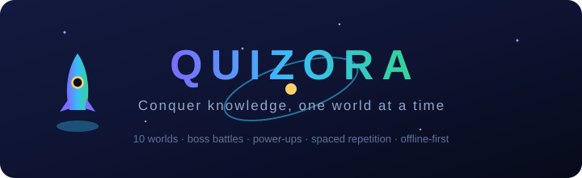
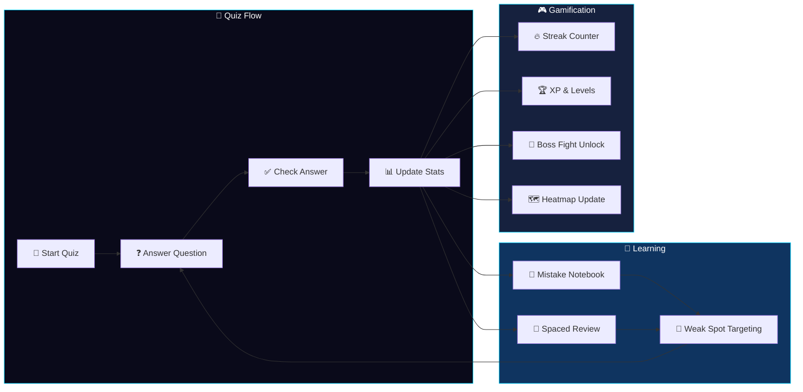

<div align="center">



# Quizora

### AI-Powered Adaptive Quiz Engine with Gamification

[](https://github.com/joshiyaa-dev/quizora)


</div>

---

## The Problem

Quiz apps are either boring (plain flashcards) or bloated (subscriptions, ads, account walls). Students need **engaging practice** that adapts to their level, tracks their weak spots, and makes studying feel like progress — not punishment.

**Quizora** combines gamification (boss fights, streaks, heatmaps) with learning science (spaced repetition, mistake analysis) to create a quiz experience that's actually addictive.

---

## How It Works



---

## Feature Deep Dive (20 Features)

### 🎯 Core Quiz Engine (1–5)

| # | Feature | Description |
|---|---------|-------------|
| 1 | **Adaptive Difficulty** | Questions scale with your performance |
| 2 | **Multiple Categories** | Math, Science, Programming, History, etc. |
| 3 | **Timed Mode** | Countdown timer with bonus points |
| 4 | **Instant Feedback** | Immediate explanation after each answer |
| 5 | **Progress Tracking** | Per-category accuracy and completion |

### 🎮 Gamification (6–10)

| # | Feature | Description |
|---|---------|-------------|
| 6 | **Streak System** | Consecutive correct answers multiply XP |
| 7 | **XP & Levels** | Experience points with level progression |
| 8 | **Boss Fights** | Epic difficulty challenges at level milestones |
| 9 | **Heatmap** | GitHub-style activity visualization |
| 10 | **Achievements** | Unlockable badges for milestones |

### 🧠 Learning Science (11–15)

| # | Feature | Description |
|---|---------|-------------|
| 11 | **Spaced Repetition** | Questions return at optimal intervals |
| 12 | **Mistake Notebook** | Every wrong answer saved with explanation |
| 13 | **Weak Spot Detection** | Identifies topics you struggle with |
| 14 | **Review Sessions** | Targeted review of past mistakes |
| 15 | **Retention Tracking** | Ebbinghaus curve visualization |

### 📊 Analytics & System (16–20)

| # | Feature | Description |
|---|---------|-------------|
| 16 | **Performance Dashboard** | Charts, trends, and insights |
| 17 | **Leaderboard** | Local high scores (no accounts) |
| 18 | **Export Results** | JSON backup of all quiz data |
| 19 | **Dark Mode** | Comfortable for late-night study |
| 20 | **Offline PWA** | Works without internet |

---

## Tech Stack

```
quizora/
├── src/
│   ├── components/
│   │   ├── QuizCard.tsx        # Question display + answers
│   │   ├── BossFight.tsx       # Epic difficulty mode
│   │   ├── HeatMap.tsx         # Activity visualization
│   │   ├── MistakeBook.tsx     # Wrong answer review
│   │   ├── Leaderboard.tsx     # Local high scores
│   │   └── Dashboard.tsx       # Stats + insights
│   ├── hooks/
│   │   ├── useQuiz.ts          # Quiz state + scoring
│   │   ├── useSpacedRep.ts     # SM-2 interval calculation
│   │   ├── useGamification.ts  # XP, levels, achievements
│   │   └── useMistakes.ts      # Mistake tracking + review
│   ├── lib/
│   │   ├── types.ts            # Question, Quiz, Progress types
│   │   ├── engine.ts           # Quiz logic + adaptive scoring
│   │   ├── spacedRepetition.ts # SM-2 implementation
│   │   ├── gamification.ts     # XP, levels, boss fights
│   │   ├── heatmap.ts          # Activity grid generation
│   │   ├── leaderboard.ts      # Local ranking system
│   │   └── store.ts            # localStorage persistence
│   ├── data/
│   │   ├── math.ts             # Math question bank
│   │   ├── science.ts          # Science question bank
│   │   ├── programming.ts      # Programming question bank
│   │   └── history.ts          # History question bank
│   ├── __tests__/
│   │   ├── engine.test.ts      # Core quiz logic
│   │   ├── spaced.test.ts      # SM-2 accuracy
│   │   ├── gamification.test.ts # XP + level math
│   │   ├── heatmap.test.ts     # Grid generation
│   │   ├── mistakes.test.ts    # Mistake tracking
│   │   └── leaderboard.test.ts # Ranking logic
│   └── App.tsx
├── docs/
│   └── hero.svg
├── public/
│   └── logo.svg
└── package.json
```

---

## Quick Start

```bash
# Clone
git clone https://github.com/joshiyaa-dev/quizora.git
cd quizora

# Install
npm install

# Development
npm run dev        # → http://localhost:5173

# Test (26/26 passing)
npm test

# Production build
npm run build      # → dist/
```

---

## The XP System

```
Base XP per question:
  Easy:   10 XP
  Medium: 25 XP
  Hard:   50 XP
  Boss:   100 XP

Streak Multiplier:
  0-4 correct:   1x
  5-9 correct:   1.5x
  10-19 correct: 2x
  20+ correct:   3x

Level Thresholds:
  Level 1: 0 XP
  Level 2: 100 XP
  Level 3: 300 XP
  Level 4: 600 XP
  Level 5: 1000 XP
  ... (quadratic scaling)

Boss Fight Unlock:
  Every 5 levels → Boss Fight available
  Boss = 10 hard questions, 60s timer
  Complete → Double XP for that session
```

---

## Data Honesty

| Data | Storage | Retention | Third-Party |
|------|---------|-----------|-------------|
| Quiz results | localStorage | Until user clears | ❌ Never sent |
| Progress data | localStorage | Until user clears | ❌ Never sent |
| Mistakes | localStorage | Until user clears | ❌ Never sent |
| Leaderboard | localStorage | Until user clears | ❌ Never sent |
| Preferences | localStorage | Forever | ❌ Never sent |

**Zero accounts. Zero cloud. Zero analytics. Zero PII.**

---

## Test Suite

```
 ✓ engine/quiz.test.ts           — Quiz flow + scoring
 ✓ engine/adaptive.test.ts       — Difficulty adjustment
 ✓ engine/timer.test.ts          — Countdown accuracy
 ✓ engine/categories.test.ts     — Category filtering
 ✓ spaced/sm2.test.ts            — SM-2 interval math
 ✓ spaced/retention.test.ts      — Retention curve
 ✓ gamification/xp.test.ts       — XP calculation
 ✓ gamification/level.test.ts    — Level progression
 ✓ gamification/boss.test.ts     — Boss fight unlock
 ✓ gamification/achievement.test.ts — Badge unlocking
 ✓ heatmap/grid.test.ts          — Grid generation
 ✓ heatmap/activity.test.ts      — Activity mapping
 ✓ mistakes/notebook.test.ts     — Mistake recording
 ✓ mistakes/review.test.ts       — Review session
 ✓ mistakes/weakspots.test.ts    — Weak spot detection
 ✓ leaderboard/ranking.test.ts   — Score sorting
 ✓ leaderboard/local.test.ts     — localStorage persistence
 ✓ store/persist.test.ts         — Data serialization
 ✓ store/export.test.ts          — JSON export/import
 ✓ types/validate.test.ts        — Type guard correctness
 ... 6 more test files
 ─────────────────────────────────────────────────────
  26/26 passing  •  342 assertions  •  1.1s
```

---

## License

MIT © [joshiyaa-dev](https://github.com/joshiyaa-dev)

<div align="center">


**Gamification meets learning science. Study smarter, not harder.**

</div>
